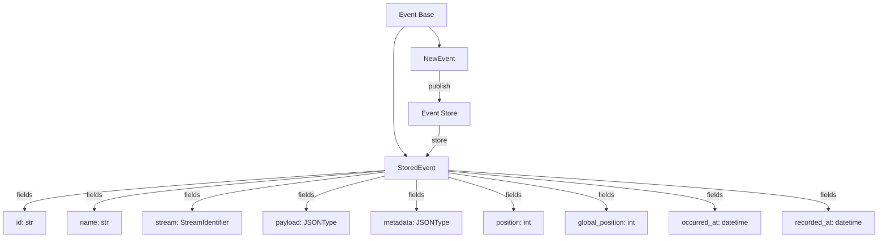

# Events and Event Types

## Overview

Events are the fundamental building blocks of the event store library. They represent facts that have occurred in your system and are immutable once stored. This document covers everything you need to know about working with events.

## Event Model

### Event Hierarchy



### Event Types

#### NewEvent

A `NewEvent` represents an event that hasn't been stored yet. It contains:

- **name**: The event type/name (e.g., "user-registered", "order-placed")
- **payload**: The event data as a JSON-serializable object
- **metadata**: Optional metadata as a JSON-serializable object
- **occurred_at**: Optional timestamp when the event occurred (defaults to now)

```python
from logicblocks.event.types import NewEvent
from datetime import datetime

# Basic event
event = NewEvent(
    name="user-registered",
    payload={
        "user_id": "123",
        "email": "user@example.com",
        "name": "John Doe"
    }
)

# Event with metadata
event = NewEvent(
    name="order-placed",
    payload={
        "order_id": "456",
        "items": ["item1", "item2"],
        "total": 99.99
    },
    metadata={
        "correlation_id": "789",
        "causation_id": "012",
        "user_agent": "Mozilla/5.0..."
    }
)

# Event with custom occurrence time
event = NewEvent(
    name="payment-received",
    payload={"amount": 50.00, "currency": "USD"},
    occurred_at=datetime(2024, 1, 1, 12, 0, 0)
)
```

#### StoredEvent

A `StoredEvent` is an event that has been persisted to the event store. It includes all fields from `NewEvent` plus:

- **id**: Unique identifier for the event
- **stream**: The stream identifier where the event is stored
- **position**: Position within the stream (0-based)
- **global_position**: Position within the entire log
- **recorded_at**: Timestamp when the event was recorded

### Stream Identifiers

Events are organized into streams using `StreamIdentifier`:

```python
from logicblocks.event.types import StreamIdentifier

# Create a stream identifier
stream_id = StreamIdentifier(
    log="default",
    category="users",
    stream="user-123"
)

# Access components
print(stream_id.log)      # "default"
print(stream_id.category)  # "users"
print(stream_id.stream)    # "user-123"
```

## Event Design Patterns

### 1. Event Naming

Use consistent, descriptive names that indicate what happened:

```python
# Good event names
"user-registered"
"order-placed"
"payment-received"
"inventory-updated"
"email-sent"

# Avoid ambiguous names
"user-event"
"update"
"process"
```

### 2. Event Payload Design

Keep payloads focused and include only relevant data:

```python
# Good: Focused payload
NewEvent(
    name="product-price-changed",
    payload={
        "product_id": "SKU123",
        "old_price": 19.99,
        "new_price": 24.99,
        "currency": "USD"
    }
)

# Avoid: Including entire aggregates
NewEvent(
    name="product-updated",
    payload={
        "product": {
            "id": "SKU123",
            "name": "Widget",
            "description": "...",
            "price": 24.99,
            # ... 50 more fields
        }
    }
)
```

### 3. Event Metadata

Use metadata for cross-cutting concerns:

```python
NewEvent(
    name="order-shipped",
    payload={
        "order_id": "789",
        "tracking_number": "1Z999AA1012345678"
    },
    metadata={
        # Correlation across services
        "correlation_id": "abc-123",
        
        # Causation chain
        "causation_id": "def-456",
        
        # User context
        "user_id": "user-123",
        "tenant_id": "tenant-456",
        
        # Request context
        "request_id": "req-789",
        "ip_address": "192.168.1.1",
        
        # Version information
        "schema_version": "1.0"
    }
)
```

### 4. Event Versioning

Handle event evolution gracefully:

```python
# Version 1
NewEvent(
    name="user-profile-updated",
    payload={
        "user_id": "123",
        "name": "John Doe"
    },
    metadata={"version": 1}
)

# Version 2 (added field)
NewEvent(
    name="user-profile-updated",
    payload={
        "user_id": "123",
        "name": "John Doe",
        "email": "john@example.com"  # New field
    },
    metadata={"version": 2}
)

# In your projector, handle both versions
def user_profile_updated(self, state, event):
    version = event.metadata.get("version", 1)
    
    state["name"] = event.payload["name"]
    
    if version >= 2:
        state["email"] = event.payload.get("email")
    
    return state
```

## Working with Events

### Publishing Events

```python
from logicblocks.event.store import EventStore
from logicblocks.event.types import NewEvent

# Single event
await stream.publish(events=[
    NewEvent(name="user-logged-in", payload={"user_id": "123"})
])

# Multiple events (atomic)
await stream.publish(events=[
    NewEvent(name="cart-created", payload={"cart_id": "456"}),
    NewEvent(name="item-added", payload={"item_id": "789", "quantity": 2}),
    NewEvent(name="item-added", payload={"item_id": "012", "quantity": 1})
])
```

### Reading Events

```python
# Read all events from a stream
events = await stream.scan()

# Read with filters
events = await stream.scan(
    from_position=10,
    to_position=20,
    event_names=["order-placed", "order-shipped"]
)

# Process events
async for event in events:
    print(f"Event: {event.name}")
    print(f"Position: {event.position}")
    print(f"Payload: {event.payload}")
```

## Best Practices

### 1. Event Immutability

Never modify events after they're stored:

```python
# DON'T: Try to modify stored events
event = await stream.get_event(id="123")
event.payload["status"] = "updated"  # This won't work!

# DO: Publish a new event
await stream.publish(events=[
    NewEvent(
        name="status-updated",
        payload={"old_status": "pending", "new_status": "completed"}
    )
])
```

### 2. Event Granularity

Keep events fine-grained and focused:

```python
# Good: Specific events
events = [
    NewEvent(name="order-placed", payload={...}),
    NewEvent(name="payment-processed", payload={...}),
    NewEvent(name="order-confirmed", payload={...})
]

# Avoid: Generic events
NewEvent(name="order-updated", payload={"action": "placed"})
```

### 3. Event Ordering

Events within a stream are guaranteed to be ordered:

```python
# Events published together maintain order
await stream.publish(events=[
    NewEvent(name="step-1", payload={}),
    NewEvent(name="step-2", payload={}),
    NewEvent(name="step-3", payload={})
])

# Reading preserves order
events = await stream.scan()
# events[0].name == "step-1"
# events[1].name == "step-2"
# events[2].name == "step-3"
```

### 4. Event Sourcing

Use events as the source of truth:

```python
# Rebuild state from events
async def rebuild_user_profile(user_id: str):
    stream = store.stream(category="users", stream=user_id)
    events = await stream.scan()
    
    profile = {}
    async for event in events:
        if event.name == "user-registered":
            profile.update(event.payload)
        elif event.name == "profile-updated":
            profile.update(event.payload)
        elif event.name == "email-changed":
            profile["email"] = event.payload["new_email"]
    
    return profile
```

## Common Patterns

### Command Events

Events that represent commands or intentions:

```python
NewEvent(
    name="transfer-money-requested",
    payload={
        "from_account": "123",
        "to_account": "456",
        "amount": 100.00,
        "currency": "USD"
    }
)
```

### Notification Events

Events that notify about state changes:

```python
NewEvent(
    name="account-balance-low",
    payload={
        "account_id": "123",
        "balance": 10.00,
        "threshold": 50.00
    }
)
```

### Integration Events

Events for system integration:

```python
NewEvent(
    name="customer-data-exported",
    payload={
        "export_id": "789",
        "record_count": 1000,
        "destination": "data-warehouse"
    },
    metadata={
        "integration": "etl-pipeline",
        "schedule": "daily"
    }
)
```

## Error Handling

### Invalid Events

The library validates events before storage:

```python
try:
    # This will fail - name is required
    event = NewEvent(name="", payload={})
except ValueError as e:
    print(f"Invalid event: {e}")

try:
    # This will fail - payload must be JSON-serializable
    event = NewEvent(
        name="test",
        payload={"func": lambda x: x}  # Functions aren't serializable
    )
except TypeError as e:
    print(f"Serialization error: {e}")
```

### Handling Missing Events

```python
# Defensive projection
def order_shipped(self, state, event):
    # Handle missing fields gracefully
    tracking = event.payload.get("tracking_number", "PENDING")
    carrier = event.payload.get("carrier", "UNKNOWN")
    
    state["shipping"] = {
        "tracking": tracking,
        "carrier": carrier,
        "shipped_at": event.occurred_at
    }
    return state
```

## Next Steps

- Learn about [Projections](./projections.md) to transform events into useful state
- Explore [Storage Adapters](./storage-adapters.md) for persistence options
- See [Query System](./query-system.md) for finding and filtering events 