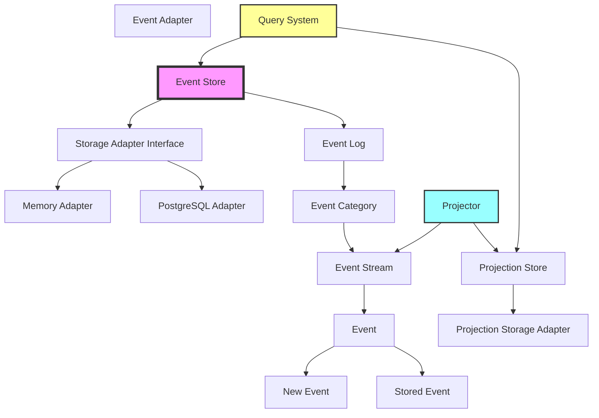
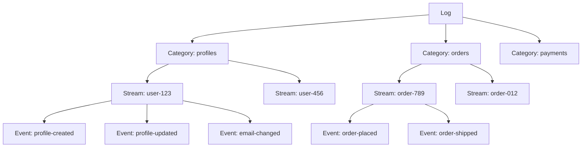
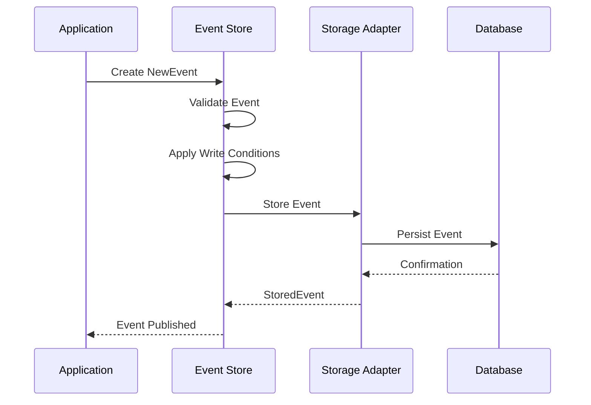
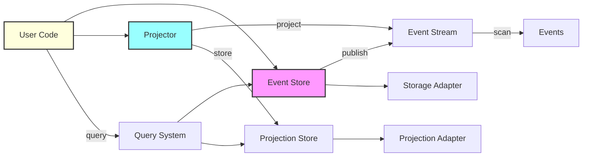

# Event Store Library Overview

## Introduction

The `logicblocks.event.store` library is a comprehensive eventing infrastructure designed for building event-sourced architectures. It provides a robust foundation for implementing event-driven systems with support for event storage, projections, querying, and more.

## Core Concepts

### Architecture Overview



### Event Model

The library uses a hierarchical event model:



### Event Lifecycle



## Key Features

### 1. Event Storage
- **Immutable and Append-Only**: Events are never modified once stored
- **Bi-temporal Support**: Tracks both occurrence time and recording time
- **Consistency Guarantees**: Optimistic concurrency control for stream updates
- **Write Conditions**: Extensible pre-condition evaluation system
- **Ordering Guarantees**: Serialized writes ensure consistent event ordering

### 2. Storage Adapters
- **Pluggable Architecture**: Abstract base class for implementing custom adapters
- **In-Memory Adapter**: For testing and development
- **PostgreSQL Adapter**: Production-ready persistent storage
- **Extensible**: Easy to add support for other databases

### 3. Projections
- **Event Reduction**: Transform event sequences into meaningful state
- **Metadata Tracking**: Automatic version and timestamp management
- **Projection Store**: Built-in storage and querying for projections
- **Custom Projectors**: Define your own projection logic

### 4. Query System
- **Flexible Querying**: Rich query language for events and projections
- **Filtering**: Support for various filter operations
- **Ordering**: Control result ordering
- **Pagination**: Built-in support for paginated results

### 5. Transaction Support
- **Retry Logic**: Automatic retry on transient failures
- **Error Handling**: Configurable error handling strategies
- **Batch Operations**: Support for atomic multi-event operations

## Component Interaction



## Usage Patterns

### 1. Event Sourcing Pattern
```
Application → NewEvent → EventStore → StoredEvent → Projector → Projection → Query
```

### 2. CQRS Pattern
```
Commands → EventStore (Write Model)
Queries → ProjectionStore (Read Model)
```

### 3. Event-Driven Architecture
```
Service A → Event → EventStore → Event Handler → Service B
```

## Next Steps

For detailed information on specific topics, see:

- [Events and Event Types](./events.md) - Deep dive into event modeling
- [Storage Adapters](./storage-adapters.md) - Working with different storage backends
- [Projections](./projections.md) - Building and managing projections
- [Query System](./query-system.md) - Querying events and projections
- [Transactions](./transactions.md) - Transaction support and error handling
- [Testing](./testing.md) - Testing utilities and best practices
- [API Reference](./api-reference.md) - Complete API documentation 