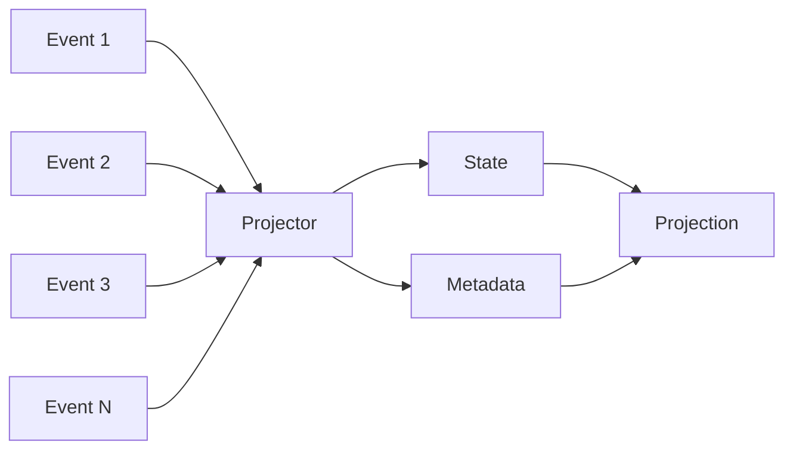
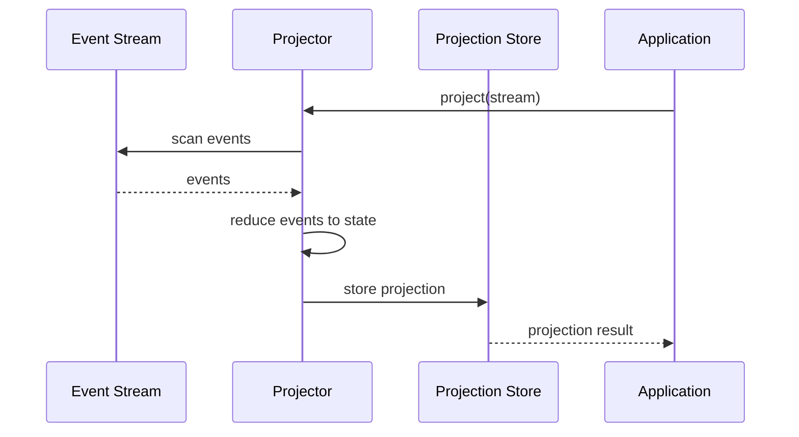

# Projections

## Overview

Projections transform event streams into meaningful state by reducing (folding) a sequence of events into a single value. They are a fundamental concept in event sourcing, allowing you to derive current state from historical events. This document covers how to create and use projections effectively.

## Concepts

### What is a Projection?



A projection consists of:
- **State**: The derived data from events
- **Metadata**: Information about the projection (version, timestamps, etc.)
- **ID**: Unique identifier for the projection

### Projection Flow



## Creating Projectors

### Basic Projector

```python
from logicblocks.event.projection import Projector
from logicblocks.event.types import StreamIdentifier

class UserProfileProjector(
    Projector[StreamIdentifier, dict, dict]
):
    """
    Type parameters:
    - StreamIdentifier: Source type
    - dict: State type
    - dict: Metadata type
    """
    
    def initial_state_factory(self) -> dict:
        """Create initial state."""
        return {
            "name": None,
            "email": None,
            "phone": None,
            "address": None,
            "created_at": None,
            "last_login": None
        }
    
    def initial_metadata_factory(self) -> dict:
        """Create initial metadata."""
        return {
            "version": 0,
            "events_processed": 0
        }
    
    def id_factory(self, state: dict, source: StreamIdentifier) -> str:
        """Generate projection ID."""
        return f"user-profile:{source.stream}"
    
    # Event handlers - method names match event names with underscores
    def user_registered(self, state: dict, event) -> dict:
        """Handle user-registered event."""
        state["name"] = event.payload["name"]
        state["email"] = event.payload["email"]
        state["created_at"] = event.occurred_at
        return state
    
    def profile_updated(self, state: dict, event) -> dict:
        """Handle profile-updated event."""
        state.update(event.payload)
        return state
    
    def email_changed(self, state: dict, event) -> dict:
        """Handle email-changed event."""
        state["email"] = event.payload["new_email"]
        return state
    
    def user_logged_in(self, state: dict, event) -> dict:
        """Handle user-logged-in event."""
        state["last_login"] = event.occurred_at
        return state
```

### Using a Projector

```python
from logicblocks.event.store import EventStore

# Create projector
projector = UserProfileProjector()

# Project from a stream
stream = store.stream(category="users", stream="user-123")
projection = await projector.project(source=stream)

# Access projection data
print(projection.id)        # "user-profile:user-123"
print(projection.state)     # {"name": "John", "email": "john@example.com", ...}
print(projection.metadata)  # {"version": 4, "events_processed": 4}
```

## Advanced Projector Features

### Event Name Mapping

Handle events with special characters or different naming conventions:

```python
class OrderProjector(Projector[StreamIdentifier, dict, dict]):
    def initial_state_factory(self) -> dict:
        return {"status": "pending", "items": [], "total": 0}
    
    # Map event names to handler methods
    @handles("order-placed")
    def handle_order_placed(self, state: dict, event) -> dict:
        state["status"] = "placed"
        state["items"] = event.payload["items"]
        return state
    
    @handles("payment-received")
    def handle_payment(self, state: dict, event) -> dict:
        state["status"] = "paid"
        state["payment_amount"] = event.payload["amount"]
        return state
```

### Metadata Tracking

Track additional information about projections:

```python
class TrackedProjector(Projector[StreamIdentifier, dict, dict]):
    def initial_metadata_factory(self) -> dict:
        return {
            "version": 0,
            "events_processed": 0,
            "last_event_id": None,
            "last_event_position": -1,
            "projection_time": None
        }
    
    def project_event(self, state: dict, metadata: dict, event) -> tuple[dict, dict]:
        """Override to track metadata for each event."""
        # Update state using appropriate handler
        new_state = super().project_event(state, metadata, event)[0]
        
        # Update metadata
        metadata["version"] += 1
        metadata["events_processed"] += 1
        metadata["last_event_id"] = event.id
        metadata["last_event_position"] = event.position
        metadata["projection_time"] = datetime.now()
        
        return new_state, metadata
```

### Conditional Projection

Project only specific events or conditions:

```python
class ConditionalProjector(Projector[StreamIdentifier, dict, dict]):
    def should_handle_event(self, event) -> bool:
        """Filter events before processing."""
        # Only process events from specific time period
        if event.occurred_at < datetime(2024, 1, 1):
            return False
        
        # Only process specific event types
        allowed_events = ["important-event", "critical-update"]
        return event.name in allowed_events
    
    def project(self, source, **kwargs):
        """Override project to filter events."""
        filtered_source = FilteredEventSource(
            source, 
            filter_fn=self.should_handle_event
        )
        return super().project(filtered_source, **kwargs)
```

## Projection Patterns

### 1. Aggregate Projection

Combine multiple related entities:

```python
class CustomerOrdersProjector(Projector[StreamIdentifier, dict, dict]):
    def initial_state_factory(self) -> dict:
        return {
            "customer_id": None,
            "total_orders": 0,
            "total_spent": 0.0,
            "orders": [],
            "loyalty_tier": "bronze"
        }
    
    def order_placed(self, state: dict, event) -> dict:
        state["customer_id"] = event.payload["customer_id"]
        state["total_orders"] += 1
        state["total_spent"] += event.payload["total"]
        state["orders"].append({
            "order_id": event.payload["order_id"],
            "amount": event.payload["total"],
            "date": event.occurred_at
        })
        
        # Update loyalty tier
        if state["total_spent"] > 1000:
            state["loyalty_tier"] = "gold"
        elif state["total_spent"] > 500:
            state["loyalty_tier"] = "silver"
        
        return state
```

### 2. Snapshot Projection

Create point-in-time snapshots:

```python
class InventorySnapshotProjector(Projector[StreamIdentifier, dict, dict]):
    def __init__(self, snapshot_date: datetime):
        self.snapshot_date = snapshot_date
        super().__init__()
    
    def initial_state_factory(self) -> dict:
        return {
            "items": {},
            "total_value": 0.0,
            "snapshot_date": self.snapshot_date
        }
    
    def should_handle_event(self, event) -> bool:
        # Only process events up to snapshot date
        return event.occurred_at <= self.snapshot_date
    
    def item_added(self, state: dict, event) -> dict:
        item_id = event.payload["item_id"]
        quantity = event.payload["quantity"]
        price = event.payload["price"]
        
        if item_id not in state["items"]:
            state["items"][item_id] = {"quantity": 0, "price": price}
        
        state["items"][item_id]["quantity"] += quantity
        state["total_value"] += quantity * price
        return state
```

### 3. Time-Window Projection

Project events within a specific time window:

```python
class DailyActivityProjector(Projector[StreamIdentifier, dict, dict]):
    def __init__(self, date: date):
        self.date = date
        self.start = datetime.combine(date, time.min)
        self.end = datetime.combine(date, time.max)
        super().__init__()
    
    def initial_state_factory(self) -> dict:
        return {
            "date": self.date,
            "events_by_hour": {h: 0 for h in range(24)},
            "total_events": 0,
            "unique_users": set()
        }
    
    def should_handle_event(self, event) -> bool:
        return self.start <= event.occurred_at <= self.end
    
    def user_action(self, state: dict, event) -> dict:
        hour = event.occurred_at.hour
        state["events_by_hour"][hour] += 1
        state["total_events"] += 1
        state["unique_users"].add(event.payload.get("user_id"))
        return state
```

## Projection Store

Store and query projections:

```python
from logicblocks.event.projection.store import ProjectionStore
from logicblocks.event.query import where, Query

# Create projection store
projection_store = ProjectionStore(adapter=storage_adapter)

# Store projection
projection = await projector.project(source=stream)
await projection_store.save(projection)

# Query projections
# Find by ID
projection = await projection_store.get(id="user-profile:user-123")

# Query with filters
results = await projection_store.query(
    Query(
        filter=where("state.loyalty_tier") == "gold",
        order_by=[("state.total_spent", "desc")],
        limit=10
    )
)

# Update projection
projection.state["last_updated"] = datetime.now()
await projection_store.save(projection)
```

## Performance Optimization

### 1. Incremental Projections

Update projections incrementally instead of rebuilding:

```python
class IncrementalProjector:
    async def update_projection(self, stream, projection_store):
        # Get existing projection
        projection_id = f"profile:{stream.identifier.stream}"
        existing = await projection_store.get(projection_id)
        
        if existing:
            # Project only new events
            last_position = existing.metadata.get("last_position", -1)
            events = stream.scan(from_position=last_position + 1)
        else:
            # Full projection for new streams
            events = stream.scan()
        
        # Continue projection from existing state
        state = existing.state if existing else self.initial_state_factory()
        metadata = existing.metadata if existing else self.initial_metadata_factory()
        
        async for event in events:
            state, metadata = self.project_event(state, metadata, event)
        
        # Save updated projection
        projection = Projection(
            id=projection_id,
            state=state,
            metadata=metadata
        )
        await projection_store.save(projection)
```

### 2. Cached Projections

Cache frequently accessed projections:

```python
from functools import lru_cache
import asyncio

class CachedProjectionService:
    def __init__(self, projector, store, cache_ttl=60):
        self.projector = projector
        self.store = store
        self.cache_ttl = cache_ttl
        self._cache = {}
        self._cache_times = {}
    
    async def get_projection(self, stream_id: str) -> Projection:
        # Check cache
        if stream_id in self._cache:
            cache_time = self._cache_times[stream_id]
            if time.time() - cache_time < self.cache_ttl:
                return self._cache[stream_id]
        
        # Load or create projection
        projection_id = f"cached:{stream_id}"
        projection = await self.store.get(projection_id)
        
        if not projection:
            # Create new projection
            stream = self.event_store.stream(stream=stream_id)
            projection = await self.projector.project(stream)
            await self.store.save(projection)
        
        # Update cache
        self._cache[stream_id] = projection
        self._cache_times[stream_id] = time.time()
        
        return projection
```

### 3. Parallel Projections

Project multiple streams in parallel:

```python
async def project_multiple_streams(projector, streams):
    """Project multiple streams concurrently."""
    tasks = [
        projector.project(stream) 
        for stream in streams
    ]
    
    projections = await asyncio.gather(*tasks)
    return projections

# Usage
streams = [
    store.stream(category="users", stream=f"user-{i}")
    for i in range(100)
]

projections = await project_multiple_streams(
    UserProfileProjector(), 
    streams
)
```

## Testing Projections

### Unit Testing Projectors

```python
import pytest
from logicblocks.event.testing import EventBuilder

class TestUserProfileProjector:
    @pytest.fixture
    def projector(self):
        return UserProfileProjector()
    
    def test_initial_state(self, projector):
        state = projector.initial_state_factory()
        assert state["name"] is None
        assert state["email"] is None
    
    def test_user_registered_event(self, projector):
        # Create test event
        event = EventBuilder() \
            .with_name("user-registered") \
            .with_payload({
                "name": "John Doe",
                "email": "john@example.com"
            }) \
            .build()
        
        # Project event
        state = projector.initial_state_factory()
        new_state = projector.user_registered(state, event)
        
        # Verify state
        assert new_state["name"] == "John Doe"
        assert new_state["email"] == "john@example.com"
    
    @pytest.mark.asyncio
    async def test_full_projection(self, projector, event_store):
        # Create events
        stream = event_store.stream(category="users", stream="test-user")
        await stream.publish(events=[
            NewEvent(
                name="user-registered",
                payload={"name": "Test User", "email": "test@example.com"}
            ),
            NewEvent(
                name="email-changed",
                payload={"new_email": "newemail@example.com"}
            )
        ])
        
        # Project
        projection = await projector.project(stream)
        
        # Verify
        assert projection.state["name"] == "Test User"
        assert projection.state["email"] == "newemail@example.com"
        assert projection.metadata["events_processed"] == 2
```

## Best Practices

### 1. Idempotent Projections

Ensure projections produce the same result when run multiple times:

```python
def balance_updated(self, state: dict, event) -> dict:
    # Idempotent: set to specific value
    state["balance"] = event.payload["new_balance"]
    return state
    
    # NOT idempotent: relative change
    # state["balance"] += event.payload["change"]
```

### 2. Error Handling

Handle missing or invalid data gracefully:

```python
def safe_projection(self, state: dict, event) -> dict:
    try:
        # Defensive data access
        user_data = event.payload.get("user", {})
        state["name"] = user_data.get("name", "Unknown")
        state["age"] = int(user_data.get("age", 0))
    except (ValueError, TypeError) as e:
        # Log error but don't fail projection
        logger.warning(f"Error projecting event {event.id}: {e}")
        state["errors"] = state.get("errors", [])
        state["errors"].append({
            "event_id": event.id,
            "error": str(e)
        })
    
    return state
```

### 3. Projection Versioning

Handle projection schema changes:

```python
class VersionedProjector(Projector):
    PROJECTION_VERSION = 2
    
    def initial_metadata_factory(self) -> dict:
        return {
            "projection_version": self.PROJECTION_VERSION,
            "schema_version": 1
        }
    
    def migrate_projection(self, projection):
        """Migrate old projections to new schema."""
        version = projection.metadata.get("projection_version", 1)
        
        if version < 2:
            # Migrate from v1 to v2
            projection.state["new_field"] = "default_value"
            projection.metadata["projection_version"] = 2
        
        return projection
```

## Next Steps

- Explore the [Query System](./query-system.md) for finding projections
- Learn about [Transactions](./transactions.md) for coordinating updates
- See [Testing](./testing.md) for projection testing strategies 