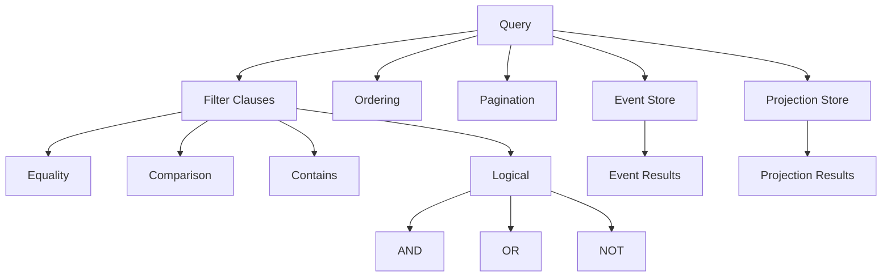

# Query System

## Overview

The event store library provides a powerful and flexible query system for finding events and projections. The query system supports filtering, ordering, pagination, and complex conditions. This document covers how to effectively use the query capabilities.

## Query Architecture



## Basic Queries

### Querying Events

```python
from logicblocks.event.query import Query, where

# Query events from a stream
stream = store.stream(category="users", stream="user-123")

# Get all events
events = await stream.scan()

# Filter by event name
events = await stream.scan(
    event_names=["user-registered", "profile-updated"]
)

# Filter by position range
events = await stream.scan(
    from_position=10,
    to_position=20
)

# Limit results
events = await stream.scan(limit=100)
```

### Querying Categories

```python
# Query all events in a category
category = store.category("users")

# Scan with filters
events = await category.scan(
    event_names=["user-registered"],
    limit=50
)

# Time-based queries
from datetime import datetime, timedelta

yesterday = datetime.now() - timedelta(days=1)
events = await category.scan(
    from_occurred_at=yesterday,
    to_occurred_at=datetime.now()
)
```

## Advanced Filtering

### Using the Where Clause

The `where` function creates flexible filter conditions:

```python
from logicblocks.event.query import where

# Equality
filter = where("payload.status") == "active"

# Comparison
filter = where("payload.amount") > 100
filter = where("payload.age") >= 18
filter = where("payload.score") < 50
filter = where("payload.discount") <= 0.2

# Contains
filter = where("payload.tags").contains("important")
filter = where("payload.email").contains("@example.com")

# Null checks
filter = where("payload.deleted_at").is_null()
filter = where("payload.description").is_not_null()
```

### Combining Filters

```python
# AND conditions
filter = (
    (where("payload.status") == "active") &
    (where("payload.age") >= 18) &
    (where("payload.country") == "US")
)

# OR conditions
filter = (
    (where("payload.priority") == "high") |
    (where("payload.urgent") == True)
)

# Complex combinations
filter = (
    (where("payload.status") == "active") &
    (
        (where("payload.role") == "admin") |
        (where("payload.role") == "moderator")
    )
)

# NOT conditions
filter = ~(where("payload.status") == "deleted")
```

### Nested Field Access

Query nested fields using dot notation:

```python
# Nested object fields
filter = where("payload.user.profile.email") == "john@example.com"
filter = where("payload.address.city") == "New York"
filter = where("metadata.correlation_id") == "abc-123"

# Array access (if supported by storage)
filter = where("payload.items[0].name") == "Widget"
filter = where("payload.tags").contains("featured")
```

## Projection Queries

### Basic Projection Queries

```python
from logicblocks.event.projection.store import ProjectionStore

projection_store = ProjectionStore(adapter)

# Get by ID
projection = await projection_store.get("user-profile:user-123")

# Query all projections
projections = await projection_store.query(Query())

# Query with filter
query = Query(
    filter=where("state.status") == "active"
)
projections = await projection_store.query(query)
```

### Complex Projection Queries

```python
# Multi-field filtering
query = Query(
    filter=(
        (where("state.total_orders") > 10) &
        (where("state.loyalty_tier") == "gold") &
        (where("state.last_order_date") > datetime(2024, 1, 1))
    )
)

# Query with ordering
query = Query(
    filter=where("state.status") == "active",
    order_by=[
        ("state.created_at", "desc"),
        ("state.name", "asc")
    ]
)

# Pagination
query = Query(
    filter=where("state.category") == "electronics",
    order_by=[("state.price", "desc")],
    limit=20,
    offset=40  # Skip first 40 results
)
```

## Query Patterns

### 1. Time-Based Queries

```python
# Events in the last hour
one_hour_ago = datetime.now() - timedelta(hours=1)
recent_events = await stream.scan(
    from_occurred_at=one_hour_ago
)

# Events in a specific date range
start_date = datetime(2024, 1, 1)
end_date = datetime(2024, 1, 31)
january_events = await category.scan(
    from_occurred_at=start_date,
    to_occurred_at=end_date
)

# Projections updated recently
query = Query(
    filter=where("metadata.last_updated") > datetime.now() - timedelta(minutes=5)
)
```

### 2. Search Patterns

```python
# Case-insensitive search (if supported)
query = Query(
    filter=where("state.email").icontains("@EXAMPLE.com")
)

# Prefix search
query = Query(
    filter=where("state.sku").startswith("PROD-")
)

# Range queries
query = Query(
    filter=(
        (where("state.price") >= 10.00) &
        (where("state.price") <= 100.00)
    )
)
```

### 3. Aggregation Patterns

While the query system doesn't directly support aggregation, you can implement it in your application:

```python
async def count_by_status(projection_store):
    """Count projections by status."""
    all_projections = await projection_store.query(Query())
    
    counts = {}
    async for projection in all_projections:
        status = projection.state.get("status", "unknown")
        counts[status] = counts.get(status, 0) + 1
    
    return counts

async def get_top_customers(projection_store, limit=10):
    """Get top customers by total spent."""
    query = Query(
        filter=where("state.total_spent") > 0,
        order_by=[("state.total_spent", "desc")],
        limit=limit
    )
    
    return await projection_store.query(query)
```

## Performance Optimization

### 1. Efficient Filtering

```python
# Use indexes effectively
# Filter on indexed fields first
query = Query(
    filter=(
        # Indexed field first
        (where("state.category") == "electronics") &
        # Then more specific filters
        (where("state.brand") == "Apple") &
        (where("state.in_stock") == True)
    )
)

# Avoid complex operations on large datasets
# BAD: Loading all data then filtering in memory
all_projections = await projection_store.query(Query())
filtered = [p for p in all_projections if complex_condition(p)]

# GOOD: Filter at query level
query = Query(filter=build_filter_from_condition())
filtered = await projection_store.query(query)
```

### 2. Pagination Strategy

```python
async def paginate_results(store, page_size=100):
    """Efficiently paginate through large result sets."""
    offset = 0
    
    while True:
        query = Query(
            order_by=[("id", "asc")],  # Consistent ordering
            limit=page_size,
            offset=offset
        )
        
        results = await store.query(query)
        result_count = 0
        
        async for item in results:
            result_count += 1
            yield item
        
        if result_count < page_size:
            break
            
        offset += page_size

# Usage
async for projection in paginate_results(projection_store):
    process_projection(projection)
```

### 3. Cursor-Based Pagination

For better performance with large datasets:

```python
async def cursor_paginate(store, page_size=100):
    """Cursor-based pagination for better performance."""
    last_id = None
    
    while True:
        if last_id:
            filter_clause = where("id") > last_id
        else:
            filter_clause = None
            
        query = Query(
            filter=filter_clause,
            order_by=[("id", "asc")],
            limit=page_size
        )
        
        results = await store.query(query)
        result_count = 0
        
        async for item in results:
            result_count += 1
            last_id = item.id
            yield item
        
        if result_count < page_size:
            break
```

## Query Builders

Create reusable query builders for common patterns:

```python
class QueryBuilder:
    """Fluent query builder."""
    
    def __init__(self):
        self._filters = []
        self._order_by = []
        self._limit = None
        self._offset = None
    
    def where(self, field, operator, value):
        if operator == "==":
            self._filters.append(where(field) == value)
        elif operator == ">":
            self._filters.append(where(field) > value)
        elif operator == "contains":
            self._filters.append(where(field).contains(value))
        return self
    
    def and_where(self, field, operator, value):
        return self.where(field, operator, value)
    
    def order_by(self, field, direction="asc"):
        self._order_by.append((field, direction))
        return self
    
    def limit(self, limit):
        self._limit = limit
        return self
    
    def offset(self, offset):
        self._offset = offset
        return self
    
    def build(self):
        filter_clause = None
        if self._filters:
            filter_clause = self._filters[0]
            for f in self._filters[1:]:
                filter_clause = filter_clause & f
        
        return Query(
            filter=filter_clause,
            order_by=self._order_by,
            limit=self._limit,
            offset=self._offset
        )

# Usage
query = (QueryBuilder()
    .where("state.status", "==", "active")
    .and_where("state.priority", ">", 5)
    .order_by("state.created_at", "desc")
    .limit(10)
    .build())
```

## Testing Queries

### Unit Testing

```python
import pytest
from logicblocks.event.query import Query, where

class TestQueries:
    def test_equality_filter(self):
        filter = where("status") == "active"
        assert filter.field == "status"
        assert filter.operator == "=="
        assert filter.value == "active"
    
    def test_combined_filters(self):
        filter = (
            (where("age") >= 18) &
            (where("country") == "US")
        )
        assert filter.operator == "AND"
        assert len(filter.clauses) == 2
    
    @pytest.mark.asyncio
    async def test_projection_query(self, projection_store):
        # Create test projections
        await projection_store.save(
            Projection(
                id="test-1",
                state={"status": "active", "score": 100}
            )
        )
        await projection_store.save(
            Projection(
                id="test-2",
                state={"status": "inactive", "score": 50}
            )
        )
        
        # Query active projections
        query = Query(filter=where("state.status") == "active")
        results = list(await projection_store.query(query))
        
        assert len(results) == 1
        assert results[0].id == "test-1"
```

## Best Practices

### 1. Use Specific Filters

```python
# GOOD: Specific filters reduce data transfer
query = Query(
    filter=(
        (where("state.category") == "electronics") &
        (where("state.brand") == "Apple") &
        (where("state.model") == "iPhone 15")
    )
)

# BAD: Loading all data and filtering in memory
all_items = await store.query(Query())
iphones = [i for i in all_items if is_iphone_15(i)]
```

### 2. Index Considerations

```python
# Design queries around your indexes
# If you have an index on (category, created_at)
query = Query(
    filter=where("state.category") == "orders",
    order_by=[("state.created_at", "desc")]
)
```

### 3. Query Monitoring

```python
import time
import logging

logger = logging.getLogger(__name__)

async def monitored_query(store, query):
    """Execute query with performance monitoring."""
    start_time = time.time()
    result_count = 0
    
    try:
        results = await store.query(query)
        async for item in results:
            result_count += 1
            yield item
    finally:
        duration = time.time() - start_time
        logger.info(
            f"Query completed: {result_count} results in {duration:.2f}s",
            extra={
                "query_filter": str(query.filter),
                "result_count": result_count,
                "duration": duration
            }
        )
```

## Next Steps

- Learn about [Transactions](./transactions.md) for coordinated operations
- Explore [Testing](./testing.md) for query testing strategies
- See [API Reference](./api-reference.md) for complete query API 