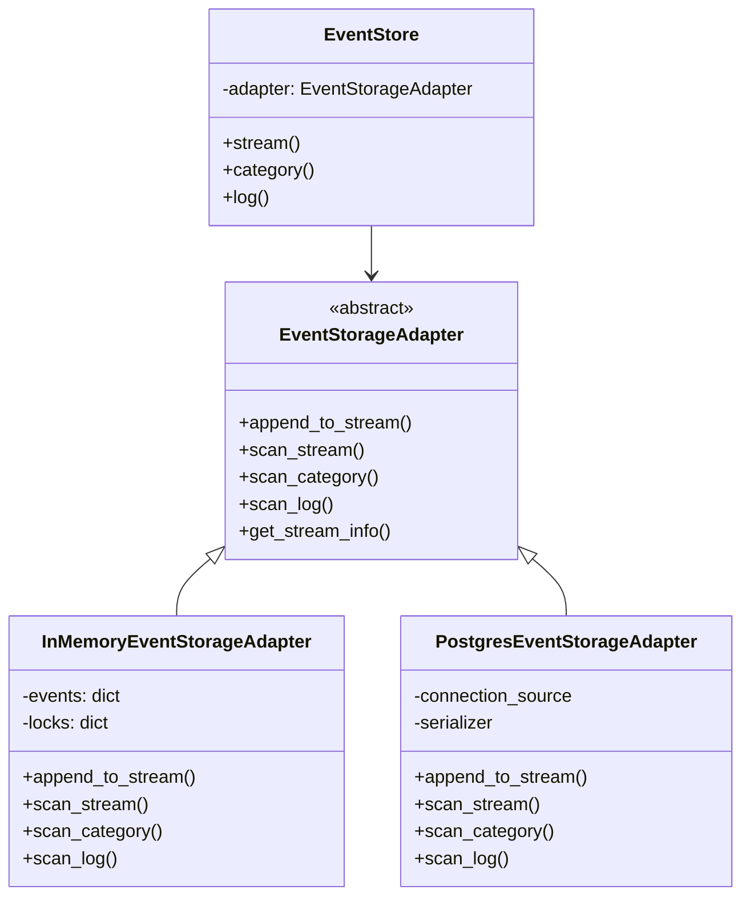

# Storage Adapters

## Overview

Storage adapters provide the persistence layer for the event store. The library uses an adapter pattern that allows you to switch between different storage backends without changing your application code. This document covers the available adapters and how to create custom ones.

## Architecture



## Available Adapters

### In-Memory Adapter

The in-memory adapter stores events in memory and is perfect for:
- Unit testing
- Development
- Prototyping
- Temporary event storage

```python
from logicblocks.event.store import EventStore
from logicblocks.event.store.adapters import InMemoryEventStorageAdapter

# Create adapter and store
adapter = InMemoryEventStorageAdapter()
store = EventStore(adapter)

# Use the store normally
stream = store.stream(category="users", stream="user-123")
await stream.publish(events=[...])
```

**Characteristics:**
- ✅ Fast performance
- ✅ No external dependencies
- ✅ Thread-safe
- ❌ Data lost on restart
- ❌ Not suitable for production

### PostgreSQL Adapter

The PostgreSQL adapter provides durable storage backed by PostgreSQL:

```python
from logicblocks.event.store.adapters import PostgresEventStorageAdapter
from logicblocks.event.persistence import ConnectionSource
import asyncpg

# Create connection source
async def create_connection():
    return await asyncpg.connect(
        host="localhost",
        port=5432,
        user="eventstore",
        password="password",
        database="events"
    )

connection_source = ConnectionSource(create_connection)

# Create adapter with connection source
adapter = PostgresEventStorageAdapter(
    connection_source=connection_source
)

# Create store
store = EventStore(adapter)
```

**Characteristics:**
- ✅ Durable storage
- ✅ ACID compliance
- ✅ Production ready
- ✅ Supports concurrent access
- ✅ Built-in indexing
- ❌ Requires PostgreSQL

#### Database Schema

The PostgreSQL adapter uses the following schema:

```sql
-- Events table
CREATE TABLE events (
    id UUID PRIMARY KEY,
    log VARCHAR(255) NOT NULL,
    category VARCHAR(255) NOT NULL,
    stream VARCHAR(255) NOT NULL,
    name VARCHAR(255) NOT NULL,
    payload JSONB NOT NULL,
    metadata JSONB,
    position INTEGER NOT NULL,
    global_position BIGSERIAL,
    occurred_at TIMESTAMPTZ NOT NULL,
    recorded_at TIMESTAMPTZ NOT NULL DEFAULT NOW(),
    
    -- Unique constraint for position within stream
    CONSTRAINT unique_stream_position 
        UNIQUE (log, category, stream, position)
);

-- Indexes for efficient querying
CREATE INDEX idx_events_stream 
    ON events (log, category, stream, position);
CREATE INDEX idx_events_category 
    ON events (log, category, global_position);
CREATE INDEX idx_events_log 
    ON events (log, global_position);
CREATE INDEX idx_events_name 
    ON events (name);
CREATE INDEX idx_events_occurred_at 
    ON events (occurred_at);
```

#### Connection Management

```python
# Using connection pooling
async def create_pool():
    return await asyncpg.create_pool(
        host="localhost",
        port=5432,
        user="eventstore",
        password="password",
        database="events",
        min_size=10,
        max_size=20
    )

pool = await create_pool()
connection_source = ConnectionSource(lambda: pool.acquire())

# With environment variables
import os

async def create_connection():
    return await asyncpg.connect(
        host=os.getenv("DB_HOST", "localhost"),
        port=int(os.getenv("DB_PORT", 5432)),
        user=os.getenv("DB_USER"),
        password=os.getenv("DB_PASSWORD"),
        database=os.getenv("DB_NAME", "events")
    )
```

## Adapter Configuration

### Serialization

Both adapters support custom serialization:

```python
from logicblocks.event.types.conversion import Serializer
import json
from datetime import datetime

class CustomSerializer(Serializer):
    def serialize(self, value):
        # Custom serialization logic
        if isinstance(value, datetime):
            return value.isoformat()
        return json.dumps(value)
    
    def deserialize(self, value):
        # Custom deserialization logic
        return json.loads(value)

# Use with PostgreSQL adapter
adapter = PostgresEventStorageAdapter(
    connection_source=connection_source,
    serializer=CustomSerializer()
)
```

### Write Serialization

Control concurrent writes with serialization constraints:

```python
from logicblocks.event.store import constraints

# Serialize at stream level (default)
adapter = PostgresEventStorageAdapter(
    connection_source=connection_source,
    serialization_constraint=constraints.stream_serialization()
)

# Serialize at category level
adapter = PostgresEventStorageAdapter(
    connection_source=connection_source,
    serialization_constraint=constraints.category_serialization()
)

# Serialize at log level
adapter = PostgresEventStorageAdapter(
    connection_source=connection_source,
    serialization_constraint=constraints.log_serialization()
)

# No serialization (parallel writes)
adapter = PostgresEventStorageAdapter(
    connection_source=connection_source,
    serialization_constraint=constraints.no_serialization()
)
```

## Creating Custom Adapters

To create a custom storage adapter, inherit from `EventStorageAdapter`:

```python
from logicblocks.event.store.adapters import EventStorageAdapter
from logicblocks.event.types import StoredEvent, NewEvent, StreamIdentifier
from typing import List, Optional, AsyncIterator
import uuid
from datetime import datetime

class CustomStorageAdapter(EventStorageAdapter):
    def __init__(self):
        # Initialize your storage backend
        self.storage = YourStorageBackend()
    
    async def append_to_stream(
        self,
        stream: StreamIdentifier,
        events: List[NewEvent],
        expected_position: Optional[int] = None
    ) -> List[StoredEvent]:
        """Append events to a stream."""
        stored_events = []
        
        # Get current stream position
        current_position = await self._get_stream_position(stream)
        
        # Check expected position if provided
        if expected_position is not None and expected_position != current_position:
            raise OptimisticConcurrencyError(
                f"Expected position {expected_position}, "
                f"but stream at position {current_position}"
            )
        
        # Store each event
        for event in events:
            position = current_position + 1
            global_position = await self._get_next_global_position()
            
            stored_event = StoredEvent(
                id=str(uuid.uuid4()),
                stream=stream,
                name=event.name,
                payload=event.payload,
                metadata=event.metadata,
                position=position,
                global_position=global_position,
                occurred_at=event.occurred_at or datetime.now(),
                recorded_at=datetime.now()
            )
            
            await self.storage.save(stored_event)
            stored_events.append(stored_event)
            current_position = position
        
        return stored_events
    
    async def scan_stream(
        self,
        stream: StreamIdentifier,
        from_position: Optional[int] = None,
        to_position: Optional[int] = None,
        limit: Optional[int] = None
    ) -> AsyncIterator[StoredEvent]:
        """Scan events from a stream."""
        query = self.storage.query()
        query.filter(
            log=stream.log,
            category=stream.category,
            stream=stream.stream
        )
        
        if from_position is not None:
            query.filter(position__gte=from_position)
        
        if to_position is not None:
            query.filter(position__lte=to_position)
        
        if limit is not None:
            query.limit(limit)
        
        async for event_data in query.execute():
            yield self._deserialize_event(event_data)
    
    async def scan_category(
        self,
        log: str,
        category: str,
        # ... other parameters
    ) -> AsyncIterator[StoredEvent]:
        """Scan events from a category."""
        # Implementation similar to scan_stream
        pass
    
    async def scan_log(
        self,
        log: str,
        # ... other parameters
    ) -> AsyncIterator[StoredEvent]:
        """Scan events from entire log."""
        # Implementation similar to scan_stream
        pass
    
    async def get_stream_info(
        self,
        stream: StreamIdentifier
    ) -> dict:
        """Get information about a stream."""
        count = await self.storage.count(
            log=stream.log,
            category=stream.category,
            stream=stream.stream
        )
        
        return {
            "stream": stream,
            "event_count": count,
            "position": count - 1 if count > 0 else -1
        }
```

### Adapter Requirements

Your custom adapter must implement:

1. **`append_to_stream`**: Atomically append events to a stream
2. **`scan_stream`**: Read events from a specific stream
3. **`scan_category`**: Read events from all streams in a category
4. **`scan_log`**: Read events from the entire log
5. **`get_stream_info`**: Get metadata about a stream

### Best Practices for Custom Adapters

1. **Atomicity**: Ensure all events in a batch are stored atomically
2. **Ordering**: Maintain strict ordering within streams
3. **Concurrency**: Handle concurrent writes appropriately
4. **Performance**: Implement efficient indexing for scans
5. **Error Handling**: Provide clear error messages

## Testing Storage Adapters

The library provides test utilities for adapter implementations:

```python
from logicblocks.event.testing import EventStorageAdapterTestCase
import pytest

class TestCustomAdapter(EventStorageAdapterTestCase):
    @pytest.fixture
    async def adapter(self):
        # Create and return your adapter instance
        adapter = CustomStorageAdapter()
        yield adapter
        # Cleanup if needed
        await adapter.cleanup()
    
    # The base class provides comprehensive tests
    # for adapter compliance
```

## Performance Considerations

### In-Memory Adapter

- **Memory Usage**: O(n) where n is number of events
- **Write Performance**: O(1) amortized
- **Read Performance**: O(n) for scans, can be optimized with indexing

### PostgreSQL Adapter

- **Write Performance**: Depends on disk I/O and indexes
- **Read Performance**: Optimized with indexes
- **Batch Operations**: Use transactions for better performance

```python
# Batch writes with transaction
async with adapter.transaction() as tx:
    for i in range(1000):
        await stream.publish(
            events=[NewEvent(name=f"event-{i}", payload={})],
            transaction=tx
        )
```

### Optimization Tips

1. **Use appropriate indexes** for your query patterns
2. **Batch writes** when possible
3. **Use connection pooling** for PostgreSQL
4. **Consider partitioning** for very large event stores
5. **Monitor query performance** and optimize as needed

## Migration Between Adapters

To migrate from one adapter to another:

```python
async def migrate_events(source_store, target_store):
    # Get all categories
    source_log = source_store.log()
    
    # Scan all events
    events = source_log.scan()
    
    # Group by stream
    streams = {}
    async for event in events:
        stream_id = event.stream
        if stream_id not in streams:
            streams[stream_id] = []
        streams[stream_id].append(event)
    
    # Replay to target store
    for stream_id, stream_events in streams.items():
        target_stream = target_store.stream(
            category=stream_id.category,
            stream=stream_id.stream
        )
        
        # Convert StoredEvents back to NewEvents
        new_events = [
            NewEvent(
                name=e.name,
                payload=e.payload,
                metadata=e.metadata,
                occurred_at=e.occurred_at
            )
            for e in stream_events
        ]
        
        await target_stream.publish(events=new_events)
```

## Next Steps

- Learn about [Projections](./projections.md) for event processing
- Explore the [Query System](./query-system.md) for finding events
- See [Transactions](./transactions.md) for advanced write patterns 