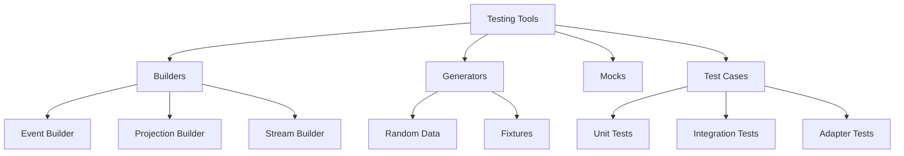

# Testing

## Overview

Testing event-sourced systems requires specialized approaches and utilities. The event store library provides comprehensive testing support including builders, data generators, and test base classes. This document covers testing strategies, utilities, and best practices.

## Testing Architecture



## Test Utilities

### Event Builder

Build test events fluently:

```python
from logicblocks.event.testing import EventBuilder
from datetime import datetime

# Basic event
event = (EventBuilder()
    .with_name("user-registered")
    .with_payload({"email": "test@example.com"})
    .build())

# Complex event
event = (EventBuilder()
    .with_id("test-event-123")
    .with_name("order-placed")
    .with_stream("orders", "order-456")
    .with_payload({
        "items": [
            {"sku": "ABC123", "quantity": 2},
            {"sku": "XYZ789", "quantity": 1}
        ],
        "total": 99.99
    })
    .with_metadata({
        "user_id": "user-123",
        "ip_address": "192.168.1.1"
    })
    .with_position(42)
    .with_global_position(1000)
    .with_occurred_at(datetime(2024, 1, 1, 12, 0, 0))
    .build())

# Build multiple events
events = (EventBuilder()
    .with_name("item-added")
    .with_payload_template({"item_id": "item-{}", "quantity": 1})
    .build_many(5))  # Creates 5 events with item-0 through item-4
```

### Projection Builder

Build test projections:

```python
from logicblocks.event.testing import ProjectionBuilder

# Simple projection
projection = (ProjectionBuilder()
    .with_id("user-profile:user-123")
    .with_state({
        "name": "Test User",
        "email": "test@example.com"
    })
    .build())

# Complex projection with metadata
projection = (ProjectionBuilder()
    .with_id("order-summary:2024-01")
    .with_state({
        "total_orders": 150,
        "total_revenue": 12500.00,
        "average_order_value": 83.33
    })
    .with_metadata({
        "version": 2,
        "last_event_position": 500,
        "updated_at": datetime.now()
    })
    .build())
```

### Data Generators

Generate random test data:

```python
from logicblocks.event.testing import generators

# Random event data
random_event = generators.random_event()
random_payload = generators.random_payload()
random_metadata = generators.random_metadata()

# Random identifiers
stream_id = generators.random_stream_identifier()
event_id = generators.random_event_id()

# Random values
email = generators.random_email()
user_id = generators.random_user_id()
amount = generators.random_amount(min=10.0, max=1000.0)
timestamp = generators.random_timestamp(
    start=datetime(2024, 1, 1),
    end=datetime(2024, 12, 31)
)

# Batch generation
events = generators.random_events(count=100)
users = generators.random_users(count=50)
```

## Unit Testing

### Testing Event Handlers

```python
import pytest
from unittest.mock import Mock, AsyncMock

class TestOrderHandlers:
    @pytest.fixture
    def handler(self):
        return OrderEventHandler()
    
    def test_order_placed_handler(self, handler):
        # Create test event
        event = (EventBuilder()
            .with_name("order-placed")
            .with_payload({
                "order_id": "123",
                "customer_id": "456",
                "total": 99.99
            })
            .build())
        
        # Test handler
        result = handler.handle_order_placed(event)
        
        # Verify
        assert result.order_id == "123"
        assert result.status == "pending"
        assert result.total == 99.99
```

### Testing Projectors

```python
class TestUserProjector:
    @pytest.fixture
    def projector(self):
        return UserProfileProjector()
    
    def test_initial_state(self, projector):
        state = projector.initial_state_factory()
        assert state == {
            "name": None,
            "email": None,
            "created_at": None
        }
    
    def test_user_registered_projection(self, projector):
        # Initial state
        state = projector.initial_state_factory()
        
        # Create event
        event = (EventBuilder()
            .with_name("user-registered")
            .with_payload({
                "name": "John Doe",
                "email": "john@example.com"
            })
            .with_occurred_at(datetime(2024, 1, 1))
            .build())
        
        # Project
        new_state = projector.user_registered(state, event)
        
        # Verify
        assert new_state["name"] == "John Doe"
        assert new_state["email"] == "john@example.com"
        assert new_state["created_at"] == datetime(2024, 1, 1)
    
    @pytest.mark.asyncio
    async def test_full_projection_flow(self, projector):
        # Create event sequence
        events = [
            (EventBuilder()
                .with_name("user-registered")
                .with_payload({"name": "Jane", "email": "jane@example.com"})
                .with_position(0)
                .build()),
            (EventBuilder()
                .with_name("profile-updated")
                .with_payload({"bio": "Software Engineer"})
                .with_position(1)
                .build()),
            (EventBuilder()
                .with_name("email-changed")
                .with_payload({"new_email": "jane.doe@example.com"})
                .with_position(2)
                .build())
        ]
        
        # Mock source
        source = AsyncMock()
        source.scan.return_value = AsyncIterator(events)
        
        # Project
        projection = await projector.project(source)
        
        # Verify final state
        assert projection.state["name"] == "Jane"
        assert projection.state["email"] == "jane.doe@example.com"
        assert projection.state["bio"] == "Software Engineer"
        assert projection.metadata["events_processed"] == 3
```

## Integration Testing

### Testing with In-Memory Store

```python
@pytest.fixture
async def event_store():
    """Create in-memory event store for testing."""
    adapter = InMemoryEventStorageAdapter()
    store = EventStore(adapter)
    yield store
    # Cleanup if needed

class TestEventStoreIntegration:
    @pytest.mark.asyncio
    async def test_publish_and_scan(self, event_store):
        # Create stream
        stream = event_store.stream(
            category="test",
            stream="integration"
        )
        
        # Publish events
        events_to_publish = [
            NewEvent(name="test-1", payload={"value": 1}),
            NewEvent(name="test-2", payload={"value": 2}),
            NewEvent(name="test-3", payload={"value": 3})
        ]
        
        published = await stream.publish(events=events_to_publish)
        
        # Verify published events
        assert len(published) == 3
        assert all(e.position is not None for e in published)
        
        # Scan events
        scanned_events = []
        async for event in stream.scan():
            scanned_events.append(event)
        
        # Verify scanned events
        assert len(scanned_events) == 3
        assert scanned_events[0].name == "test-1"
        assert scanned_events[1].payload["value"] == 2
        assert scanned_events[2].position == 2
```

### Testing Transactions

```python
class TestTransactions:
    @pytest.mark.asyncio
    async def test_transaction_commit(self, event_store):
        async with event_store_transaction(event_store) as tx:
            stream1 = tx.stream(category="accounts", stream="acc-1")
            stream2 = tx.stream(category="accounts", stream="acc-2")
            
            await stream1.publish(events=[
                NewEvent(name="debit", payload={"amount": 100})
            ])
            await stream2.publish(events=[
                NewEvent(name="credit", payload={"amount": 100})
            ])
        
        # Verify both events were committed
        events1 = list(await event_store.stream(
            category="accounts", stream="acc-1"
        ).scan())
        events2 = list(await event_store.stream(
            category="accounts", stream="acc-2"
        ).scan())
        
        assert len(events1) == 1
        assert len(events2) == 1
    
    @pytest.mark.asyncio
    async def test_transaction_rollback(self, event_store):
        with pytest.raises(ValueError):
            async with event_store_transaction(event_store) as tx:
                stream = tx.stream(category="test", stream="rollback")
                
                await stream.publish(events=[
                    NewEvent(name="event-1", payload={})
                ])
                
                # Force error
                raise ValueError("Test error")
        
        # Verify no events were committed
        events = list(await event_store.stream(
            category="test", stream="rollback"
        ).scan())
        assert len(events) == 0
```

## Component Testing

### Testing Storage Adapters

```python
from logicblocks.event.testing import EventStorageAdapterTestCase

class TestPostgresAdapter(EventStorageAdapterTestCase):
    @pytest.fixture
    async def adapter(self, postgres_connection):
        """Provide adapter instance for base tests."""
        adapter = PostgresEventStorageAdapter(
            connection_source=lambda: postgres_connection
        )
        yield adapter
        
        # Cleanup
        await postgres_connection.execute("TRUNCATE TABLE events")
    
    # Base class provides comprehensive adapter tests
    # Add custom tests for PostgreSQL-specific features
    
    @pytest.mark.asyncio
    async def test_postgres_json_querying(self, adapter):
        """Test PostgreSQL-specific JSON queries."""
        stream = StreamIdentifier("log", "category", "stream")
        
        # Publish event with nested JSON
        await adapter.append_to_stream(
            stream=stream,
            events=[
                NewEvent(
                    name="test",
                    payload={
                        "user": {
                            "name": "John",
                            "tags": ["admin", "developer"]
                        }
                    }
                )
            ]
        )
        
        # Query using PostgreSQL JSON operators
        # (Implementation depends on adapter design)
```

### Testing Projections

```python
class TestProjectionStore:
    @pytest.fixture
    async def projection_store(self, storage_adapter):
        return ProjectionStore(adapter=storage_adapter)
    
    @pytest.mark.asyncio
    async def test_save_and_retrieve(self, projection_store):
        # Create projection
        projection = (ProjectionBuilder()
            .with_id("test-projection")
            .with_state({"count": 42})
            .build())
        
        # Save
        await projection_store.save(projection)
        
        # Retrieve
        retrieved = await projection_store.get("test-projection")
        
        # Verify
        assert retrieved is not None
        assert retrieved.state["count"] == 42
    
    @pytest.mark.asyncio
    async def test_query_projections(self, projection_store):
        # Create test projections
        projections = [
            (ProjectionBuilder()
                .with_id(f"user-{i}")
                .with_state({
                    "status": "active" if i % 2 == 0 else "inactive",
                    "score": i * 10
                })
                .build())
            for i in range(10)
        ]
        
        # Save all
        for projection in projections:
            await projection_store.save(projection)
        
        # Query active users
        query = Query(
            filter=where("state.status") == "active",
            order_by=[("state.score", "desc")]
        )
        
        results = []
        async for projection in projection_store.query(query):
            results.append(projection)
        
        # Verify
        assert len(results) == 5
        assert results[0].state["score"] == 80
        assert all(p.state["status"] == "active" for p in results)
```

## Performance Testing

### Load Testing

```python
import asyncio
import time

class TestPerformance:
    @pytest.mark.asyncio
    async def test_high_volume_writes(self, event_store):
        """Test writing large number of events."""
        stream = event_store.stream(category="perf", stream="test")
        
        # Generate events
        events = [
            NewEvent(
                name="perf-test",
                payload={"index": i, "data": "x" * 100}
            )
            for i in range(1000)
        ]
        
        # Measure write time
        start_time = time.time()
        await stream.publish(events=events)
        write_duration = time.time() - start_time
        
        # Verify and measure read time
        start_time = time.time()
        read_events = []
        async for event in stream.scan():
            read_events.append(event)
        read_duration = time.time() - start_time
        
        # Assertions
        assert len(read_events) == 1000
        assert write_duration < 5.0  # Should write 1000 events in < 5s
        assert read_duration < 2.0   # Should read 1000 events in < 2s
        
        # Report metrics
        print(f"Write: {1000/write_duration:.2f} events/sec")
        print(f"Read: {1000/read_duration:.2f} events/sec")
    
    @pytest.mark.asyncio
    async def test_concurrent_writes(self, event_store):
        """Test concurrent writes to different streams."""
        async def write_to_stream(stream_id: str, count: int):
            stream = event_store.stream(
                category="concurrent",
                stream=stream_id
            )
            
            events = [
                NewEvent(name=f"event-{i}", payload={"i": i})
                for i in range(count)
            ]
            
            await stream.publish(events=events)
        
        # Launch concurrent writes
        start_time = time.time()
        tasks = [
            write_to_stream(f"stream-{i}", 100)
            for i in range(10)
        ]
        await asyncio.gather(*tasks)
        duration = time.time() - start_time
        
        # Verify
        for i in range(10):
            stream = event_store.stream(
                category="concurrent",
                stream=f"stream-{i}"
            )
            events = list(await stream.scan())
            assert len(events) == 100
        
        print(f"Concurrent writes: {1000/duration:.2f} events/sec")
```

## Test Fixtures

### Common Fixtures

```python
@pytest.fixture
async def sample_events():
    """Generate sample events for testing."""
    return [
        (EventBuilder()
            .with_name("user-registered")
            .with_payload({"user_id": "123", "email": "user@example.com"})
            .build()),
        (EventBuilder()
            .with_name("user-verified")
            .with_payload({"user_id": "123"})
            .build()),
        (EventBuilder()
            .with_name("subscription-created")
            .with_payload({"user_id": "123", "plan": "premium"})
            .build())
    ]

@pytest.fixture
async def populated_store(event_store, sample_events):
    """Event store with pre-populated data."""
    stream = event_store.stream(category="users", stream="user-123")
    await stream.publish(events=[
        NewEvent(
            name=e.name,
            payload=e.payload,
            metadata=e.metadata
        )
        for e in sample_events
    ])
    return event_store

@pytest.fixture
def mock_time():
    """Mock time for deterministic tests."""
    with patch('datetime.datetime') as mock_datetime:
        mock_datetime.now.return_value = datetime(2024, 1, 1, 12, 0, 0)
        mock_datetime.side_effect = lambda *args, **kw: datetime(*args, **kw)
        yield mock_datetime
```

## Testing Best Practices

### 1. Test Isolation

```python
class TestWithIsolation:
    @pytest.fixture(autouse=True)
    async def setup_teardown(self):
        """Ensure test isolation."""
        # Setup
        self.test_id = str(uuid.uuid4())
        
        yield
        
        # Teardown - clean up any test data
        # This is automatic with in-memory adapter
        # For persistent storage, implement cleanup
    
    def get_test_stream_id(self, suffix=""):
        """Generate unique stream IDs for each test."""
        return f"test-{self.test_id}{suffix}"
```

### 2. Deterministic Tests

```python
def test_deterministic_projection():
    """Use fixed data for deterministic results."""
    # Use builders with specific values
    events = [
        (EventBuilder()
            .with_id("fixed-id-1")
            .with_occurred_at(datetime(2024, 1, 1))
            .with_position(0)
            .build()),
        (EventBuilder()
            .with_id("fixed-id-2")
            .with_occurred_at(datetime(2024, 1, 2))
            .with_position(1)
            .build())
    ]
    
    # Test with known inputs and outputs
    projector = MyProjector()
    state = projector.initial_state_factory()
    
    for event in events:
        state = projector.project_event(state, {}, event)[0]
    
    # Verify exact state
    assert state == {
        "expected": "exact_value",
        "count": 2
    }
```

### 3. Property-Based Testing

```python
from hypothesis import given, strategies as st

class TestProperties:
    @given(
        events=st.lists(
            st.builds(
                lambda name, value: NewEvent(
                    name=name,
                    payload={"value": value}
                ),
                name=st.sampled_from(["add", "subtract", "multiply"]),
                value=st.integers(min_value=1, max_value=100)
            ),
            min_size=1,
            max_size=50
        )
    )
    @pytest.mark.asyncio
    async def test_event_ordering_preserved(self, event_store, events):
        """Events maintain order regardless of content."""
        stream = event_store.stream(
            category="property",
            stream="test"
        )
        
        # Publish events
        await stream.publish(events=events)
        
        # Read back
        read_events = list(await stream.scan())
        
        # Verify ordering
        assert len(read_events) == len(events)
        for i, (original, read) in enumerate(zip(events, read_events)):
            assert read.name == original.name
            assert read.payload == original.payload
            assert read.position == i
```

## Next Steps

- See [API Reference](./api-reference.md) for testing API details
- Review [Best Practices](./best-practices.md) for production testing
- Explore [Examples](./examples.md) for real-world test scenarios 