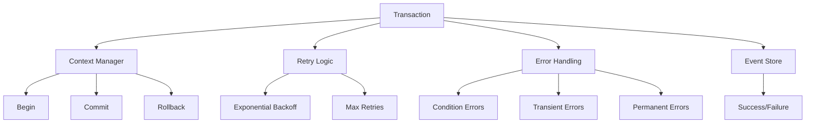

# Transactions

## Overview

The event store library provides comprehensive transaction support for coordinating complex operations, handling errors gracefully, and ensuring consistency. This document covers transaction patterns, error handling strategies, and best practices for building reliable event-sourced systems.

## Transaction Architecture



## Basic Transactions

### Using Transaction Context

```python
from logicblocks.event.store import event_store_transaction
from logicblocks.event.types import NewEvent

# Basic transaction
async with event_store_transaction(store) as tx:
    stream1 = tx.stream(category="accounts", stream="account-123")
    stream2 = tx.stream(category="accounts", stream="account-456")
    
    # All operations are atomic
    await stream1.publish(events=[
        NewEvent(
            name="money-withdrawn",
            payload={"amount": 100.00}
        )
    ])
    
    await stream2.publish(events=[
        NewEvent(
            name="money-deposited",
            payload={"amount": 100.00}
        )
    ])
    
    # Automatically commits on success
    # Automatically rolls back on error
```

### Manual Transaction Control

```python
# Manual transaction management
tx = await store.begin_transaction()

try:
    # Perform operations
    await tx.stream("users", "user-123").publish(events=[...])
    await tx.stream("logs", "audit").publish(events=[...])
    
    # Commit if successful
    await tx.commit()
except Exception as e:
    # Rollback on error
    await tx.rollback()
    raise
```

## Error Handling

### Write Condition Errors

Handle optimistic concurrency control:

```python
from logicblocks.event.store import UnmetWriteConditionError
from logicblocks.event.store.conditions import stream_empty, stream_not_empty

try:
    # Ensure stream exists before appending
    await stream.publish(
        events=[NewEvent(name="update", payload={})],
        expected_version=5  # Specific version expected
    )
except UnmetWriteConditionError as e:
    # Handle version mismatch
    print(f"Stream version mismatch: {e}")
    
    # Retry with updated expectations
    current_version = await stream.version()
    await stream.publish(
        events=[NewEvent(name="update", payload={})],
        expected_version=current_version
    )
```

### Retry Strategies

```python
from logicblocks.event.store import (
    retry_on_error,
    retry_on_unmet_condition_error
)

# Retry on any error with exponential backoff
@retry_on_error(max_attempts=3, backoff_factor=2.0)
async def process_with_retry():
    stream = store.stream(category="orders", stream="order-123")
    await stream.publish(events=[
        NewEvent(name="order-processed", payload={})
    ])

# Retry only on condition errors
@retry_on_unmet_condition_error(max_attempts=5)
async def create_if_not_exists():
    stream = store.stream(category="users", stream="user-456")
    
    # Try to create only if stream is empty
    await stream.publish(
        events=[NewEvent(name="user-created", payload={})],
        write_conditions=[stream_empty()]
    )
```

### Ignore Strategies

```python
from logicblocks.event.store import (
    ignore_on_error,
    ignore_on_unmet_condition_error
)

# Ignore all errors (use carefully!)
@ignore_on_error()
async def optional_logging():
    audit_stream = store.stream(category="audit", stream="optional")
    await audit_stream.publish(events=[
        NewEvent(name="action-logged", payload={})
    ])

# Ignore only condition errors
@ignore_on_unmet_condition_error()
async def create_once():
    stream = store.stream(category="config", stream="settings")
    await stream.publish(
        events=[NewEvent(name="initialized", payload={})],
        write_conditions=[stream_empty()]
    )
```

## Transaction Patterns

### 1. Saga Pattern

Coordinate multi-step processes:

```python
class OrderSaga:
    def __init__(self, store):
        self.store = store
        self.saga_id = str(uuid.uuid4())
    
    async def execute(self, order_data):
        """Execute order saga with compensation."""
        completed_steps = []
        
        try:
            # Step 1: Reserve inventory
            await self._reserve_inventory(order_data)
            completed_steps.append("inventory_reserved")
            
            # Step 2: Charge payment
            await self._charge_payment(order_data)
            completed_steps.append("payment_charged")
            
            # Step 3: Create shipment
            await self._create_shipment(order_data)
            completed_steps.append("shipment_created")
            
            # Step 4: Confirm order
            await self._confirm_order(order_data)
            
        except Exception as e:
            # Compensate in reverse order
            await self._compensate(completed_steps, order_data)
            raise
    
    async def _compensate(self, steps, order_data):
        """Compensate completed steps."""
        if "shipment_created" in steps:
            await self._cancel_shipment(order_data)
        
        if "payment_charged" in steps:
            await self._refund_payment(order_data)
        
        if "inventory_reserved" in steps:
            await self._release_inventory(order_data)
    
    async def _reserve_inventory(self, order_data):
        stream = self.store.stream(
            category="inventory",
            stream=order_data["product_id"]
        )
        await stream.publish(events=[
            NewEvent(
                name="inventory-reserved",
                payload={
                    "saga_id": self.saga_id,
                    "quantity": order_data["quantity"]
                }
            )
        ])
```

### 2. Process Manager Pattern

Orchestrate complex workflows:

```python
class OrderProcessManager:
    def __init__(self, store, projection_store):
        self.store = store
        self.projection_store = projection_store
    
    async def handle_event(self, event):
        """Route events to appropriate handlers."""
        handlers = {
            "order-placed": self._handle_order_placed,
            "payment-received": self._handle_payment_received,
            "inventory-checked": self._handle_inventory_checked,
            "shipment-ready": self._handle_shipment_ready
        }
        
        handler = handlers.get(event.name)
        if handler:
            await handler(event)
    
    async def _handle_order_placed(self, event):
        order_id = event.payload["order_id"]
        
        # Start payment process
        payment_stream = self.store.stream(
            category="payments",
            stream=f"payment-{order_id}"
        )
        
        await payment_stream.publish(events=[
            NewEvent(
                name="payment-requested",
                payload={
                    "order_id": order_id,
                    "amount": event.payload["total"]
                }
            )
        ])
        
        # Check inventory
        for item in event.payload["items"]:
            inventory_stream = self.store.stream(
                category="inventory",
                stream=item["product_id"]
            )
            
            await inventory_stream.publish(events=[
                NewEvent(
                    name="inventory-check-requested",
                    payload={
                        "order_id": order_id,
                        "product_id": item["product_id"],
                        "quantity": item["quantity"]
                    }
                )
            ])
    
    async def _handle_payment_received(self, event):
        # Update order status
        order_id = event.payload["order_id"]
        order_stream = self.store.stream(
            category="orders",
            stream=order_id
        )
        
        await order_stream.publish(events=[
            NewEvent(
                name="order-paid",
                payload={"payment_id": event.payload["payment_id"]}
            )
        ])
```

### 3. Event Sourcing with Snapshots

Optimize projection rebuilding:

```python
class SnapshotTransaction:
    def __init__(self, store, projection_store):
        self.store = store
        self.projection_store = projection_store
    
    async def update_with_snapshot(self, stream_id, projector):
        """Update projection with periodic snapshots."""
        
        # Get last snapshot
        snapshot = await self.projection_store.get(
            f"snapshot:{stream_id}"
        )
        
        if snapshot:
            # Continue from snapshot
            last_position = snapshot.metadata["last_position"]
            state = snapshot.state
            metadata = snapshot.metadata
        else:
            # Start from beginning
            last_position = -1
            state = projector.initial_state_factory()
            metadata = projector.initial_metadata_factory()
        
        # Get events since snapshot
        stream = self.store.stream(stream=stream_id)
        events = stream.scan(from_position=last_position + 1)
        
        # Project new events
        event_count = 0
        async for event in events:
            state, metadata = projector.project_event(
                state, metadata, event
            )
            event_count += 1
            last_position = event.position
        
        # Save new snapshot if threshold reached
        if event_count > 100:  # Snapshot every 100 events
            snapshot = Projection(
                id=f"snapshot:{stream_id}",
                state=state,
                metadata={
                    **metadata,
                    "last_position": last_position,
                    "snapshot_time": datetime.now()
                }
            )
            await self.projection_store.save(snapshot)
        
        # Save current projection
        projection = Projection(
            id=f"current:{stream_id}",
            state=state,
            metadata=metadata
        )
        await self.projection_store.save(projection)
```

## Advanced Transaction Features

### Distributed Transactions

Coordinate across multiple stores:

```python
class DistributedTransaction:
    def __init__(self, stores):
        self.stores = stores  # Dict of name -> store
        self.operations = []
    
    async def __aenter__(self):
        self.transactions = {}
        for name, store in self.stores.items():
            self.transactions[name] = await store.begin_transaction()
        return self
    
    async def __aexit__(self, exc_type, exc_val, exc_tb):
        if exc_type is None:
            # Commit all
            for tx in self.transactions.values():
                await tx.commit()
        else:
            # Rollback all
            for tx in self.transactions.values():
                await tx.rollback()
    
    def get_store(self, name):
        return self.transactions[name]

# Usage
async with DistributedTransaction({
    "events": event_store,
    "projections": projection_store
}) as dt:
    # Operations across stores
    events_tx = dt.get_store("events")
    projections_tx = dt.get_store("projections")
    
    # Coordinated updates
    await events_tx.stream("users", "user-123").publish(...)
    await projections_tx.save(projection)
```

### Conditional Transactions

Execute based on conditions:

```python
from logicblocks.event.store.conditions import (
    stream_exists,
    position_is,
    any_condition,
    all_conditions
)

class ConditionalTransaction:
    async def transfer_if_sufficient_balance(
        self,
        from_account: str,
        to_account: str,
        amount: float
    ):
        async with event_store_transaction(self.store) as tx:
            # Check balance projection
            from_projection = await self.projection_store.get(
                f"balance:{from_account}"
            )
            
            if from_projection.state["balance"] < amount:
                raise InsufficientBalanceError()
            
            # Execute transfer with conditions
            from_stream = tx.stream(
                category="accounts",
                stream=from_account
            )
            to_stream = tx.stream(
                category="accounts",
                stream=to_account
            )
            
            # Ensure both accounts exist
            await from_stream.publish(
                events=[
                    NewEvent(
                        name="money-withdrawn",
                        payload={"amount": amount}
                    )
                ],
                write_conditions=[stream_exists()]
            )
            
            await to_stream.publish(
                events=[
                    NewEvent(
                        name="money-deposited",
                        payload={"amount": amount}
                    )
                ],
                write_conditions=[stream_exists()]
            )
```

## Performance Optimization

### Batch Operations

```python
class BatchProcessor:
    def __init__(self, store, batch_size=100):
        self.store = store
        self.batch_size = batch_size
    
    async def process_batch(self, items):
        """Process items in batches for better performance."""
        for i in range(0, len(items), self.batch_size):
            batch = items[i:i + self.batch_size]
            
            async with event_store_transaction(self.store) as tx:
                # Process batch in single transaction
                tasks = []
                for item in batch:
                    stream = tx.stream(
                        category=item["category"],
                        stream=item["stream"]
                    )
                    task = stream.publish(events=item["events"])
                    tasks.append(task)
                
                # Execute concurrently within transaction
                await asyncio.gather(*tasks)
```

### Connection Pooling

```python
class PooledTransactionManager:
    def __init__(self, connection_pool):
        self.pool = connection_pool
    
    async def execute_with_connection(self, operation):
        """Execute operation with pooled connection."""
        async with self.pool.acquire() as connection:
            adapter = PostgresEventStorageAdapter(
                connection_source=lambda: connection
            )
            store = EventStore(adapter)
            
            async with event_store_transaction(store) as tx:
                return await operation(tx)
```

## Testing Transactions

```python
import pytest
from unittest.mock import AsyncMock

class TestTransactions:
    @pytest.mark.asyncio
    async def test_transaction_rollback(self, event_store):
        """Test transaction rollback on error."""
        stream = event_store.stream(
            category="test",
            stream="rollback-test"
        )
        
        # Get initial state
        initial_events = list(await stream.scan())
        
        try:
            async with event_store_transaction(event_store) as tx:
                test_stream = tx.stream(
                    category="test",
                    stream="rollback-test"
                )
                
                await test_stream.publish(events=[
                    NewEvent(name="test-event", payload={})
                ])
                
                # Force error
                raise Exception("Test error")
        except Exception:
            pass
        
        # Verify rollback
        final_events = list(await stream.scan())
        assert len(final_events) == len(initial_events)
    
    @pytest.mark.asyncio
    async def test_retry_logic(self):
        """Test retry on transient errors."""
        mock_operation = AsyncMock()
        mock_operation.side_effect = [
            Exception("Transient error"),
            Exception("Transient error"),
            "Success"
        ]
        
        @retry_on_error(max_attempts=3)
        async def operation_with_retry():
            return await mock_operation()
        
        result = await operation_with_retry()
        assert result == "Success"
        assert mock_operation.call_count == 3
```

## Best Practices

### 1. Keep Transactions Small

```python
# GOOD: Small, focused transactions
async with event_store_transaction(store) as tx:
    stream = tx.stream(category="orders", stream=order_id)
    await stream.publish(events=[
        NewEvent(name="order-confirmed", payload={})
    ])

# BAD: Large, complex transactions
async with event_store_transaction(store) as tx:
    # Too many operations in one transaction
    for order in large_order_list:
        # Process hundreds of orders...
```

### 2. Use Appropriate Isolation

```python
# Read committed for most cases
async with event_store_transaction(
    store,
    isolation_level="read_committed"
) as tx:
    # Standard operations
    pass

# Serializable for critical operations
async with event_store_transaction(
    store,
    isolation_level="serializable"
) as tx:
    # Critical financial operations
    pass
```

### 3. Handle Errors Gracefully

```python
async def safe_operation(store):
    """Operation with comprehensive error handling."""
    max_retries = 3
    retry_count = 0
    
    while retry_count < max_retries:
        try:
            async with event_store_transaction(store) as tx:
                # Perform operations
                return await do_work(tx)
                
        except UnmetWriteConditionError as e:
            # Handle concurrency conflicts
            retry_count += 1
            if retry_count >= max_retries:
                raise
            await asyncio.sleep(0.1 * retry_count)
            
        except ConnectionError as e:
            # Handle connection issues
            logger.error(f"Connection error: {e}")
            raise
            
        except Exception as e:
            # Handle unexpected errors
            logger.error(f"Unexpected error: {e}")
            raise
```

## Next Steps

- Explore [Testing](./testing.md) for transaction testing strategies
- See [API Reference](./api-reference.md) for complete transaction API
- Learn about [Best Practices](./best-practices.md) for production systems 